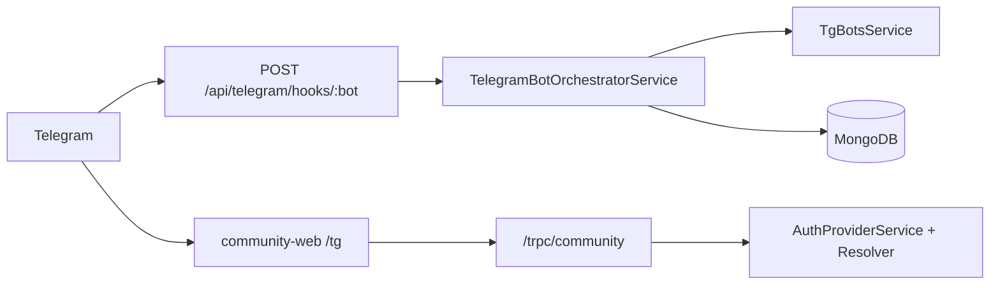

# PRD: Telegram Bot + Mini App — post-migration hardening

## Цель

Довести связку **Telegram Bot (API) + community-web Mini App** до production-grade: стабильность webhook, согласованная семантика `telegramFrozenAt`, UX ошибок и mini-app polish — **без** повторения migration epic (`7670d8fb`) и full-safe pack (`e346e4f7`).

**Релиз:** Phase 1–2 — **сейчас** (2 PR). Phase 3 — **отложена** до стабилизации на prod.

## Контекст

### Уже сделано (out of scope)

| Пакет | Коммиты |
|-------|---------|
| Migration, relink, anchor decoupling, repair script, runbook §13 | `7670d8fb` |
| Full-safe: runbook §14, structured logs, TG_MSG unify, freeze/disabled tests | `e346e4f7` |

### Архитектура (in scope)



### Scope (жёстко)

| In scope | Out of scope |
|----------|----------------|
| API: orchestrator, tg-bots, resolver, scripts, runbook | **`web/` (большой Meriter)** — любые изменения |
| **community-web** Mini App (`/tg`, `/c/...`) | Redirect/guard web→community-web |
| Runbook, deep link docs | web captive-browser, TelegramHint |
| | Vote panel ON → hint при реакциях (**молчаливый игнор — финальное поведение**) |

### Продуктовые решения (утверждено)

- Mini App = **community-web only**; misconfig BotFather URL → runbook/ops, не код в `web`.
- **`telegramVotePanelEnabled === true`** → реакции 👍/❤️/👎 **не обрабатываются и не упоминаются**; голос только через panel. **Не менять.**

---

## Проблемы (remaining backlog)

### Stability (Phase 1)

1. **Webhook** — нет error boundary; throw → non-200 → Telegram retries.
2. **`telegramFrozenAt`** — mini-app resolver считает `null` frozen; bot/`getByTelegramChatId` — active. Расхождение ломает boot после `$unset`-сбоев.
3. **`mapTelegramUserFacingError`** — EN-only fallback → ложные «не хватает заслуг».
4. **Anonymous reactions** (`message_reaction_count`) — только log; пользователь видит тишину.

### UX (Phase 2)

1. **DM multi-community** — текст `multipleLinkedCommunities`, нет inline picker (в mini-app picker есть).
2. **`/start relink:`** — только lead + pending onboarding chat id.
3. **community-web** — frozen banner без CTA; boot errors без retry.

### Отложено (Phase 3)

- Orchestrator decomposition (~4100 LOC).
- Sentry metrics expansion.
- `merge-telegram-duplicate-community.ts`, MirrorPublication legacy chat ids.
- Доп. E2E gaps beyond Phase 1–2.

---

## Phase 1 — Bot stability (PR-1)

### FR-1.1 Webhook resilience

- [`telegram-webhook.controller.ts`](../api/apps/meriter/src/infrastructure/telegram/telegram-webhook.controller.ts): `try/catch` вокруг `handleUpdate`; **всегда HTTP 200**.
- Structured log: `telegram.webhook.error` + `updateId`, `Sentry.captureException`.
- Dedup по `update_id` — **spike only** (не в MVP Phase 1).

### FR-1.2 Unified frozen semantics

Новый util [`telegram-community-frozen.util.ts`](../api/apps/meriter/src/infrastructure/telegram/telegram-community-frozen.util.ts):

```typescript
// frozen только при truthy Date; null / absent = active
isTelegramCommunityFrozen(community)
mongoActiveTelegramCommunityFilter()
mongoFrozenTelegramCommunityFilter()
```

**Заменить** ad-hoc проверки в:

- [`telegram-community-chat.resolver.ts`](../api/apps/meriter/src/infrastructure/telegram/telegram-community-chat.resolver.ts) — `isActiveForTelegramMiniApp`, `pickPreferredCommunityMatch`
- [`resolve-telegram-community.use-case.ts`](../api/apps/meriter/src/application/use-cases/communities/resolve-telegram-community.use-case.ts) — `listForUser` query
- [`get-community-by-telegram-chat-id.use-case.ts`](../api/apps/meriter/src/application/use-cases/communities/get-community-by-telegram-chat-id.use-case.ts) — `isFrozen`
- [`telegram-bot.orchestrator.service.ts`](../api/apps/meriter/src/infrastructure/telegram/telegram-bot.orchestrator.service.ts) — все `telegramFrozenAt` checks

Script: [`api/scripts/normalize-telegram-frozen-at.ts`](../api/scripts/normalize-telegram-frozen-at.ts) — `--dry-run` / `--apply` для `$unset` на `telegramFrozenAt: null`.

### FR-1.3 Vote error mapping

[`telegram-messages.ru.ts`](../api/apps/meriter/src/infrastructure/telegram/telegram-messages.ru.ts) — `mapTelegramUserFacingError`:

- Убрать fallback `EN-only → insufficientMerits`.
- Точные RU для: insufficient quota, insufficient wallet, permission, self-vote, downvote disabled, closed post.
- Generic fallback: нейтральное «Не удалось выполнить действие» (не «не хватает заслуг»).

Тесты: `telegram-messages.ru.spec.ts`.

### FR-1.4 Anonymous reactions hint

- `TG_MSG.anonymousReactionsDisabled` — ephemeral hint в группе.
- `handleMessageReactionCount` — debounce 5 min per `chatId:messageId`.
- Skip если community frozen или `telegramVotePanelEnabled === true`.

### Regression (Phase 1)

- **Vote panel ON + message_reaction** → silent ignore (новый test в `telegram-bot-orchestrator.spec.ts`).

### Acceptance (Phase 1)

- [ ] Webhook throw → HTTP 200, `telegram.webhook.error` logged.
- [ ] `telegramFrozenAt: null` → active в bot + mini-app resolver.
- [ ] Correct vote error copy (no false insufficient merits).
- [ ] Anonymous reaction → ephemeral hint (debounced).
- [ ] Vote panel + reaction → **no bot message** (regression).
- [ ] `pnpm lint && pnpm lint:fix && pnpm test && pnpm build` green.
- [ ] `@meriter/api` version bump (patch).

---

## Phase 2 — UX: bot + community-web (PR-2)

**Без изменений в `web/`.**

### FR-2.1 Bot — личка

**DM multi-community picker**

- При 2+ TG-linked communities (без `defaultTelegramCommunityId`): inline keyboard вместо только текста.
- Pending action `dm_command` с `{ cmd, args }`; callback `dm:pick:<communityId>`.
- Файлы: orchestrator `handleDirectBotCommand`, `handleCallbackQuery`, `buildDmCommunityPickerKeyboard` в `telegram-messages.ru.ts`.

**`/start relink:` polish**

- Роль: любой member (не только lead); migration — только lead.
- Без pending: fallback `targetChatId = community.telegramChatId`.
- Member + frozen → `relinkCommunityMemberNeedLead`; active → `relinkCommunityAlreadyActive`.

### FR-2.2 community-web — UI polish

- [`TgFrozenBanner`](../community-web/src/components/tg-frozen-banner.tsx): CTA «Добавьте бота снова в группу» + link `https://t.me/{botUsername}`.
- [`community-web/src/app/tg/page.tsx`](../community-web/src/app/tg/page.tsx): кнопка «Попробовать снова» на `auth_error`; улучшенный copy на `frozen`.

### FR-2.3 Deep link contract

- Новый [`docs/telegram-deep-links.md`](telegram-deep-links.md) — bot start payloads + `tg-boot-resolve` fixtures.
- Unit tests на `resolveTelegramBootContext` (community-web) при необходимости.

### Explicit non-goals (Phase 2)

- Vote panel hint on reaction — **removed**
- web → community-web redirect — **removed**
- `web/` package — **не трогаем**

### Acceptance (Phase 2)

- [ ] User with 2+ TG communities in DM → picker → command executes.
- [ ] Frozen mini-app → banner with CTA.
- [ ] Boot auth error → retry UX.
- [ ] Vote panel ON + 👍 → no bot message (unchanged).
- [ ] `@meriter/community-web` version bump if significant.

---

## Phase 3 — DEFERRED

| Item | Notes |
|------|-------|
| Orchestrator handlers split | Highest risk; after 1–2 stable on prod supergroup 160+ |
| Sentry metrics + runbook dashboard | |
| `merge-telegram-duplicate-community.ts` | |
| MirrorPublication legacy chat ids | |

---

## User-facing changelog

### Меняется

- **Группа:** точнее ошибки голоса; hint при anonymous reactions.
- **Личка:** picker при нескольких community; лучше relink.
- **Mini App:** frozen CTA, boot retry/copy.
- **Невидимо:** webhook stability, frozen null fix.

### Не меняется

- Vote panel ON → реакции **молча игнорируются**.
- Успешные голоса, онбординг, migration, ephemeral welcome.
- **web** в Telegram — **не трогаем**.

---

## Ограничения

- Не revert ephemeral group welcome.
- **Не менять `web/` package.**
- Не добавлять UX вокруг реакций при vote panel.
- Commits English; PRs to `dev`.

---

## Связанные файлы

| Файл | Роль |
|------|------|
| `api/.../telegram-webhook.controller.ts` | FR-1.1 |
| `api/.../telegram-community-frozen.util.ts` | FR-1.2 (new) |
| `api/.../telegram-community-chat.resolver.ts` | FR-1.2 |
| `api/.../telegram-messages.ru.ts` | FR-1.3, FR-1.4, FR-2.1 |
| `api/.../telegram-bot.orchestrator.service.ts` | FR-1.2–1.4, FR-2.1 |
| `api/scripts/normalize-telegram-frozen-at.ts` | FR-1.2 (new) |
| `community-web/src/components/tg-frozen-banner.tsx` | FR-2.2 |
| `community-web/src/app/tg/page.tsx` | FR-2.2 |
| `community-web/src/lib/tg-boot-resolve.ts` | FR-2.3 tests |
| `docs/business-docs-ru/11-telegram-bot-runbook-ru.md` | ops cross-link |
| `docs/TG-CHAT-ID-INCIDENT-HANDOFF.md` | handoff link |

---

## Handoff

После merge Phase 1–2 обновить [`docs/TG-CHAT-ID-INCIDENT-HANDOFF.md`](TG-CHAT-ID-INCIDENT-HANDOFF.md): ссылка на этот PRD, Phase 3 deferred.
