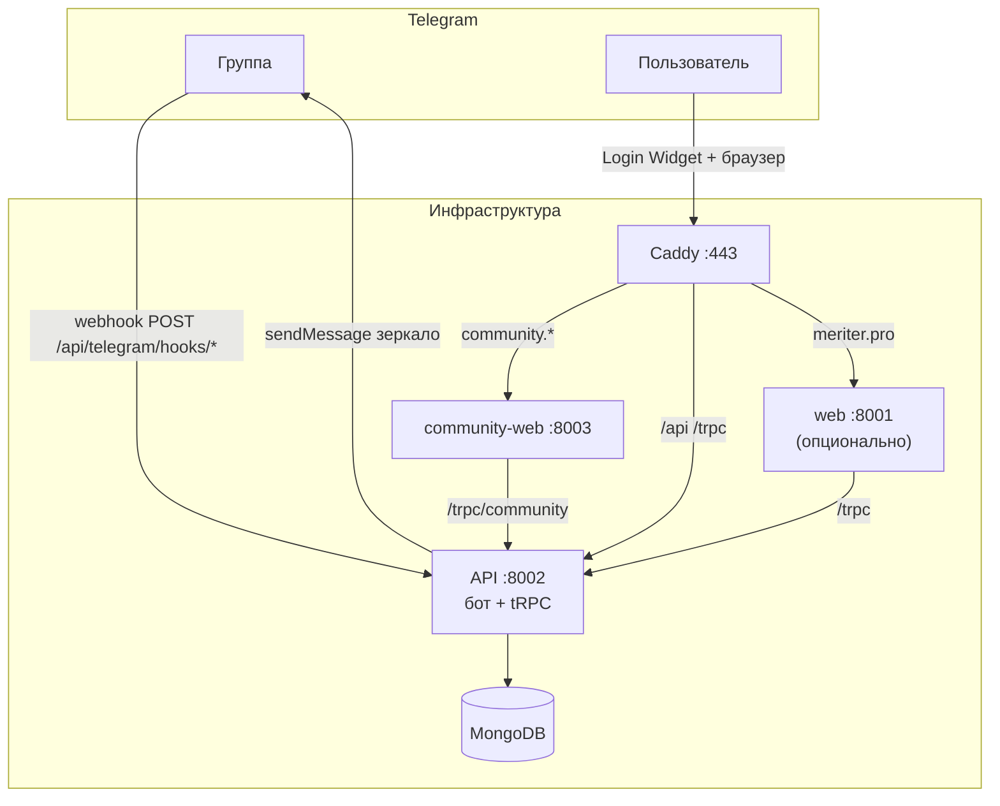

# 13. Telegram-бот + community-web — развёртывание, интеграция и использование

**Аудитория:** DevOps, разработчики, операторы пилота  
**Версии:** API ≥ 0.59.0, community-web ≥ 0.4.0  
**Связанные документы:** [10-telegram-mvp.md](./10-telegram-mvp.md), [11-telegram-bot-runbook-ru.md](./11-telegram-bot-runbook-ru.md), [12-community-web-mvp.md](./12-community-web-mvp.md), [12-community-web-runbook-ru.md](./12-community-web-runbook-ru.md)

---

## 1. Архитектура: один API, два продукта, одна интеграция



| Компонент | Где живёт | Порт |
|-----------|-----------|------|
| **Telegram-бот** | Внутри `@meriter/api` (webhook, не отдельный процесс) | 8002 |
| **community-web** | Отдельный Next.js-пакет | 8003 |
| **Полный Meriter (web)** | Опционален для TG-пилота | 8001 |
| **MongoDB** | Общая БД | 27017 (internal) |

**Ключевой принцип:** бот и веб-платформа **независимы по развёртыванию**, но **делят одну БД и один API**. Интеграция — через общие сущности (`communities`, `publications`, `telegram_publication_anchors`) и режим `MERITER_PRODUCT_MODE=telegram_mvp`.

---

## 2. Независимость и интеграция

### 2.1. Бот работает без community-web

| Условие | Что работает |
|---------|--------------|
| `TELEGRAM_BOT_ENABLED=true`, `BOT_TOKEN`, `BOT_USERNAME`, `DOMAIN`, `MONGO_URL`, `JWT_SECRET` | Онбординг группы, посты `#хэштег`, `/post`, голоса 👍❤️🤡, reply-голос, `/баланс`, `/участники`, `/фонд`, `/перевод`, freeze |
| `MERITER_PRODUCT_MODE=telegram_mvp` | Без auto-join в глобальные хабы (ОБ/Биржа/…); после хэштега — «Пост опубликован.» без ссылок на web |
| `COMMUNITY_WEB_BASE_URL` **не задан** | Бот работает; `/help` без ссылок на community-web (дефолт URL в коде не используется, если web не поднят) |
| `community-web` **не поднят** | Все команды бота в группе работают; модерация через web недоступна (флаг `telegramModerationEnabled` можно включить при онбординге, но approve/reject — только через API или позже через web) |

**Webhook:** `https://{DOMAIN}/api/telegram/hooks/{BOT_USERNAME}` — регистрируется на **основном** домене (`DOMAIN`), не на `community.*`.

### 2.2. Community-web работает без активного бота

| Условие | Что работает | Что не работает |
|---------|--------------|-----------------|
| API + MongoDB + `MERITER_PRODUCT_MODE=telegram_mvp` | Статика, маршруты UI | Любые protected tRPC-вызовы |
| `TELEGRAM_BOT_ENABLED=false` | UI, API community-router | Webhook-команды в группе |
| `BOT_TOKEN` **не задан** | Просмотр `/login` | **Telegram Login** (виджет + `auth.authenticateTelegram`) |
| Бот не добавлен в группу | Web после login (если membership есть в БД) | Зеркало web→TG, новые посты из группы |

**Вывод:** для полноценного web нужны `BOT_TOKEN` + `BOT_USERNAME` (верификация Login Widget). Для полноценного бота нужен только API. **Полная интеграция** требует оба + связанное сообщество (`telegramChatId`).

### 2.3. Точки интеграции (когда оба включены)

| Направление | Механизм | Условие |
|-------------|----------|---------|
| **Web → Telegram** | `PublicationCreated` → `MirrorPublicationToTelegramUseCase` | `telegram_mvp`, есть `telegramChatId`, не frozen, не `pending` moderation |
| **Telegram → Web** | Хэштег / `/post` → publication + anchor в Mongo | Бот онбординг завершён |
| **Модерация** | Web создаёт `pending` → лид на `/moderation` → approve → зеркало в TG | `settings.telegramModerationEnabled=true` |
| **Deep links** | `/help` → `{COMMUNITY_WEB_BASE_URL}/c/{id}/feed` | `telegram_mvp` + URL настроен |
| **Auth** | Login Widget → cookie `meriter_community_session` | `BOT_TOKEN`, membership в TG-группе |

**Изоляция от полного Meriter:**

- Cookie `meriter_community_session` ≠ cookie `jwt` основного приложения
- tRPC: `/trpc/community` + whitelist (нет Birzha, tappalka, invest, platformDev)
- Домен: `community.meriter.pro` ≠ `meriter.pro/meriter/*`

---

## 3. Результаты автоматических проверок

Команды из корня репозитория (актуально на dev, 2026-06-18):

```powershell
pnpm lint
pnpm lint:fix
pnpm test                    # API 87 suites + Web 36 suites
pnpm test:community-web      # isolation + product-scope + build
pnpm build                   # api + web + community-web
```

| Проверка | Результат |
|----------|-----------|
| `pnpm lint` / `lint:fix` | OK (warnings в legacy web, 0 errors) |
| API tests | **87** suites, **551** passed |
| Web tests | **36** suites, **163** passed |
| `test:community-web` (smoke) | isolation OK, product-scope OK, build OK |
| `pnpm build` | api + web + community-web OK |

**Telegram-специфичные тесты:**

```powershell
cd api
npx jest apps/meriter/src/infrastructure/telegram/telegram-hashtag-publication.spec.ts `
       apps/meriter/test/telegram-publication-moderation.spec.ts `
       --runInBand --forceExit
```

| Тест | Покрытие |
|------|----------|
| `telegram-hashtag-publication.spec.ts` | Webhook → publication + anchor (бот без web) |
| `telegram-publication-moderation.spec.ts` | pending → approve/reject → feed + mirror (web + API) |

---

## 4. Сценарии развёртывания

### Сценарий A — только бот (фаза 1)

**Сервисы:** `mongodb`, `api`, `caddy` (или внешний reverse proxy), `bot-webhook-init`

**Не нужны:** `web`, `community-web`

```env
MERITER_PRODUCT_MODE=telegram_mvp
TELEGRAM_BOT_ENABLED=true
BOT_TOKEN=...
BOT_USERNAME=...
DOMAIN=meriter.pro
JWT_SECRET=...
MONGO_URL=...
```

```bash
docker compose up -d mongodb api caddy
docker compose run --rm bot-webhook-init
```

### Сценарий B — только community-web (ограниченно)

**Сервисы:** `mongodb`, `api`, `community-web`, `caddy`

**Ограничение:** без `BOT_TOKEN` нет входа. Для dev допустим tunnel + реальный BotFather token.

```env
MERITER_PRODUCT_MODE=telegram_mvp
TELEGRAM_BOT_ENABLED=false          # webhook не обрабатывается
BOT_TOKEN=...                       # всё равно нужен для Login Widget
BOT_USERNAME=...
COMMUNITY_WEB_BASE_URL=https://community.meriter.pro
DOMAIN=meriter.pro
COMMUNITY_DOMAIN=community.meriter.pro
JWT_SECRET=...
MONGO_URL=...
```

```bash
docker compose up -d mongodb api community-web caddy
# bot-webhook-init — опционально
```

### Сценарий C — полная интеграция (рекомендуется для пилота)

**Сервисы:** `mongodb`, `api`, `community-web`, `caddy`, `bot-webhook-init`

**Не нужен:** `web` (полный Meriter)

```bash
docker compose up -d mongodb api community-web caddy
docker compose run --rm bot-webhook-init
```

---

## 5. Production: пошаговое развёртывание

### 5.1. Подготовка

1. **Домены и DNS**
   - `meriter.pro` → A/AAAA на сервер (webhook бота + опционально full web)
   - `community.meriter.pro` → тот же сервер (community-web)

2. **Telegram BotFather**
   - Создать бота, получить `BOT_TOKEN`
   - **Group Privacy: Off** (бот видит все сообщения)
   - **Allow Groups: On**

3. **TLS**
   - Caddy автоматически получает Let's Encrypt для `DOMAIN` и `COMMUNITY_DOMAIN`

### 5.2. Файл `.env` (корень репозитория)

```env
# === Общее ===
DOMAIN=meriter.pro
COMMUNITY_DOMAIN=community.meriter.pro
JWT_SECRET=<openssl rand -base64 32>
MONGO_ADMIN_PASSWORD=<strong>
MONGO_APP_PASSWORD=<strong>

# === Режим Telegram MVP ===
MERITER_PRODUCT_MODE=telegram_mvp
TELEGRAM_BOT_ENABLED=true
BOT_TOKEN=<from BotFather>
BOT_USERNAME=your_bot_name
COMMUNITY_WEB_BASE_URL=https://community.meriter.pro

# === Версии образов (опционально) ===
VERSION_API=0.59.0
VERSION_COMMUNITY_WEB=0.4.0
# VERSION_WEB=...   # если поднимаете full web
```

Полный шаблон: `api/env.example`.

### 5.3. Docker Compose

```bash
# Первый запуск (MongoDB replica set инициализируется автоматически)
docker compose pull
docker compose up -d mongodb
# Дождаться healthy mongodb + завершения mongodb-rs-init
docker compose up -d api community-web caddy

# Webhook (один раз после выката API)
docker compose run --rm bot-webhook-init

# Проверка webhook
docker compose run --rm -e BOT_TOKEN -e BOT_USERNAME -e DOMAIN \
  api node scripts/setup-webhook.js check
```

**Сервисы и порты (internal):**

| Service | Image | Internal port |
|---------|-------|---------------|
| `api` | `ghcr.io/ichorid/meriter-nextjs-api:*` | 8002 |
| `community-web` | `ghcr.io/ichorid/meriter-nextjs-community-web:*` | 8003 |
| `web` | `ghcr.io/ichorid/meriter-nextjs-web:*` | 8001 |
| `caddy` | `caddy:2.7-alpine` | 80, 443 |

**Маршрутизация Caddy** (`Caddyfile`):

- `{$DOMAIN}` → `web:8001`; `/api*`, `/trpc*` → `api:8002`
- `{$COMMUNITY_DOMAIN}` → `community-web:8003`; `/api*`, `/trpc*` → `api:8002`

### 5.4. CI/CD образы

Workflow: `.github/workflows/build-and-push.yml`

| Ветка | Теги |
|-------|------|
| `main` | `v{semver}`, `latest`, `sha-{short}` |
| `dev` | `{component}-dev-{full_sha}`, `{component}-dev-latest` |

Версии берутся из `api/package.json`, `community-web/package.json`, `web/package.json`.

---

## 6. Локальная разработка

### 6.1. Зависимости

```powershell
cd c:\dev\src\meriter\meriter-nextjs
pnpm install
# MongoDB replica set — docs/LOCAL_DEVELOPMENT_SETUP.md
```

### 6.2. API + community-web (без Docker)

**Terminal 1 — API:**

```powershell
# api/.env или корневой .env
$env:MERITER_PRODUCT_MODE="telegram_mvp"
$env:TELEGRAM_BOT_ENABLED="true"
$env:BOT_TOKEN="..."
$env:BOT_USERNAME="..."
$env:COMMUNITY_WEB_BASE_URL="https://community-dev.example.com"  # tunnel
pnpm dev:api
```

**Terminal 2 — community-web:**

```powershell
$env:NEXT_PUBLIC_API_URL="http://localhost:8002"
# опционально для dev без resolve:
$env:NEXT_PUBLIC_DEFAULT_COMMUNITY_ID="<community-uuid>"
pnpm dev:community-web
```

- UI: http://localhost:8003  
- API: http://localhost:8002  

### 6.3. Webhook локально (бот)

Telegram требует HTTPS. Варианты:

1. **Dev VPS + Caddy** (`https://dev.meriter.pro`)
2. **ngrok:** `ngrok http 8002` → `DOMAIN=<ngrok-host>`

```powershell
cd api
$env:DOMAIN="dev.meriter.pro"
$env:BOT_TOKEN="..."
$env:BOT_USERNAME="..."
node scripts/setup-webhook.js set
node scripts/setup-webhook.js check
```

### 6.4. Telegram Login локально

Login Widget требует HTTPS на **community-web** домене. Tunnel на `:8003` или dev subdomain.

---

## 7. Настройка и первый запуск

### 7.1. Онбординг группы (бот)

1. Создайте supergroup в Telegram.
2. Добавьте бота **администратором**.
3. В личке пройдите мастер: название, квота, хэштег, postCost, **модерация**, welcome.
4. В группе появится приветствие с командами.
5. Участники синхронизируются по событию `chat_member`.

### 7.2. Первый вход на community-web

1. Откройте `https://community.meriter.pro/login`
2. Войдите через **Telegram Login Widget** (тот же бот, что в группе).
3. Редirect на `/c/{communityId}/feed`.
4. Лид видит вкладки: Лента, Проекты, Документы, События, Заслуги, **Модерация** (если включена), Настройки.

### 7.3. Настройки лида (web)

`/c/{id}/settings`:

| Параметр | Описание |
|----------|----------|
| `postCost` | Стоимость поста в заслугах |
| `pollCost` | Стоимость опроса |
| `dailyEmission` | Дневная квота |
| `telegramModerationEnabled` | Посты из web ждут approve |

---

## 8. Использование

### 8.1. Telegram-бот (участники)

| Действие | Команда / способ |
|----------|------------------|
| Пост | `#идея Текст` (хэштег из онбординга) |
| Пост от лида | `/post Текст` |
| Баланс | `/баланс` |
| Топ участников | `/участники` |
| Фонд сообщества | `/фонд` |
| Перевод | `/перевод @user 5` или reply + `/перевод 5` |
| Голос 👍 | Реакция на якорное сообщение |
| Голос ❤️/🤡 | Реакция → сумма в личке |
| Reply-голос | `+3 спасибо` / `-2 нет` → подтверждение в DM |
| Справка | `/help` |

Подробнее: [11-telegram-bot-runbook-ru.md](./11-telegram-bot-runbook-ru.md).

### 8.2. Community-web (участники и лид)

| Раздел | URL | Возможности |
|--------|-----|-------------|
| Лента | `/c/{id}/feed` | Создание постов, лента (без pending/rejected) |
| Проекты | `/c/{id}/projects` | Список, создание, join |
| Документы | `/c/{id}/documents` | Просмотр, деталь |
| События | `/c/{id}/events` | Создание, RSVP, invite |
| Заслуги | `/c/{id}/merit-history` | История заслуг сообщества |
| Модерация | `/c/{id}/moderation` | Очередь pending (только лид) |
| Настройки | `/c/{id}/settings` | postCost, квота, модерация (только лид) |
| Профиль | `/profile` | Профиль пользователя |

**Создание поста в web:**

- Модерация **выкл.** → пост сразу в ленте + карточка `📌 …` в Telegram-группе
- Модерация **вкл.** → «отправлен на модерацию» → лид одобряет → лента + TG

### 8.3. Совместное поведение

```
Участник в TG:     #идея текст     → publication + anchor в группе
Лид в TG:          /post текст     → bot_mirror anchor
Участник в web:    новый пост      → mirror в TG (если не pending)
Лид в web:         модерация       → approve → mirror в TG
Голос в TG:        👍 на anchor    → +1 заслуга (квота → кошелёк)
```

---

## 9. Чеклист приёмки интеграции

### Бот без web

- [ ] `setup-webhook.js check` — pending=0, без last_error
- [ ] Онбординг группы за 5 мин
- [ ] `#хэштег` создаёт publication + anchor
- [ ] `/баланс`, `/перевод` работают
- [ ] Выход из группы → freeze; возврат → active

### Web без webhook (TELEGRAM_BOT_ENABLED=false)

- [ ] `https://community.*/login` открывается
- [ ] Login Widget с `botUsername` из config
- [ ] После login — feed, projects, events
- [ ] Cookie `meriter_community_session` установлен
- [ ] Cookie `jwt` с meriter.pro **не** даёт доступ

### Полная интеграция

- [ ] Пост в web → карточка в TG (модерация выкл.)
- [ ] Пост в web → pending → approve → лента + TG
- [ ] `/help` в боте содержит ссылку на `community.*/c/*/feed`
- [ ] `pnpm test:community-web` проходит
- [ ] В community-web **нет** Birzha/invest/tappalka (product-scope)

---

## 10. Устранение неполадок

| Симптом | Бот | Web | Интеграция |
|---------|-----|-----|------------|
| Бот молчит | `TELEGRAM_BOT_ENABLED`, webhook check, HTTPS | — | — |
| Login не работает | — | `BOT_TOKEN`, `MERITER_PRODUCT_MODE=telegram_mvp` | Widget domain = community.* |
| 401 на tRPC | — | cookie domain, `COMMUNITY_WEB_BASE_URL` | заголовок `X-Meriter-Product: community` |
| Нет зеркала в TG | frozen community, нет chatId | пост `pending` | `telegramChatId` в Mongo |
| resolveForTelegramUser null | пользователь не в группе | — | membership + role в БД |
| Дубль поста в TG | — | — | bot posts имеют `skipTelegramMirror` |
| pending updates растут | 5xx на webhook, логи API | — | — |

**Логи:** `TelegramBotOrchestratorService`, `MirrorPublicationToTelegramUseCase`, `TelegramPublicationModerationUseCase`.

---

## 11. Безопасность

- `BOT_TOKEN`, `JWT_SECRET`, `MONGO_*_PASSWORD` — только secrets / `.env`, **не в git**
- Webhook URL публичен, но без валидного update от Telegram обработка безопасна
- community-web: CSP разрешает `api.telegram.org`, `oauth.telegram.org`
- Изоляция продуктов проверяется CI: `check:isolation`, `check:product-scope`

---

## 12. Быстрая справка команд

```powershell
# Полный CI-прогон локально
pnpm lint && pnpm lint:fix && pnpm test && pnpm test:community-web && pnpm build

# Только Telegram-тесты
cd api
npx jest apps/meriter/src/infrastructure/telegram/telegram-hashtag-publication.spec.ts `
       apps/meriter/test/telegram-publication-moderation.spec.ts --runInBand --forceExit

# Smoke community-web
pnpm test:community-web

# Webhook
cd api && node scripts/setup-webhook.js check
cd api && node scripts/setup-webhook.js set

# Dev
pnpm dev:api
pnpm dev:community-web
```

---

## 13. Что сознательно не входит в TG-пилот

- Биржа (МД), tappalka, инвестиции, Future Visions hub
- Полный `meriter.pro/meriter/*` UI
- Email/SMS/passkey на community-web
- Отдельный процесс бота (всё в API)

См. [12-community-web-mvp.md](./12-community-web-mvp.md) §Scope.
